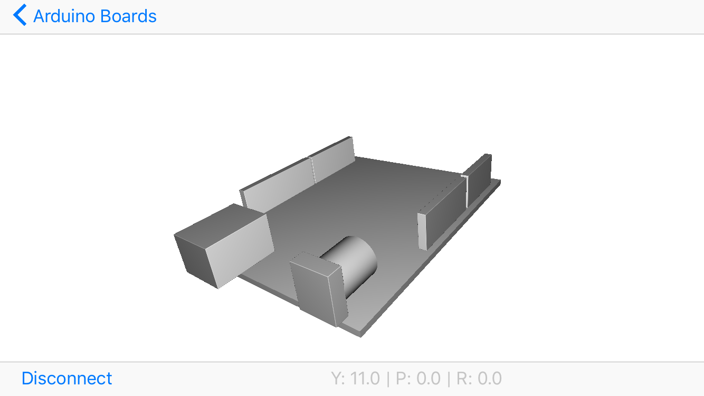

# Arduino 101 Demo

Accesses gyro/accel data from the [Arduino101 Board](https://www.arduino.cc/en/Main/ArduinoBoard101) via BLE and displays on an iOS app.

Contains an `ino` file to run on the Arduino board. This exposes the BLE service the iOS app reads.

By no means perfect. The gyro data tends to drift over time.
